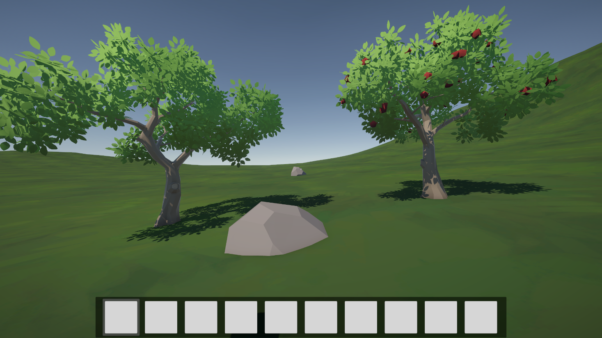
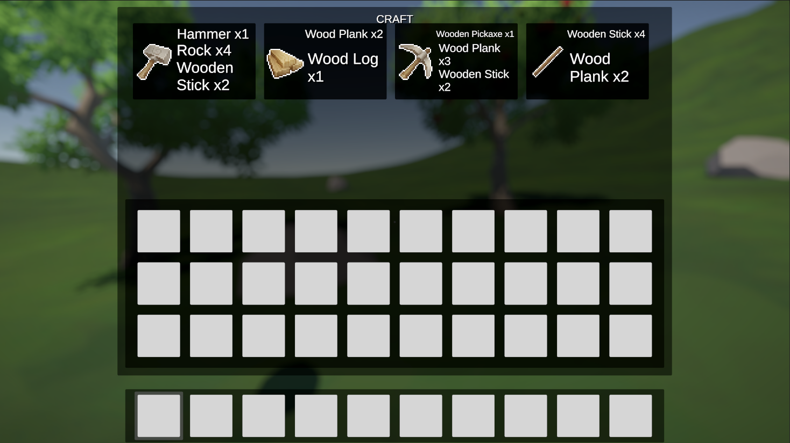
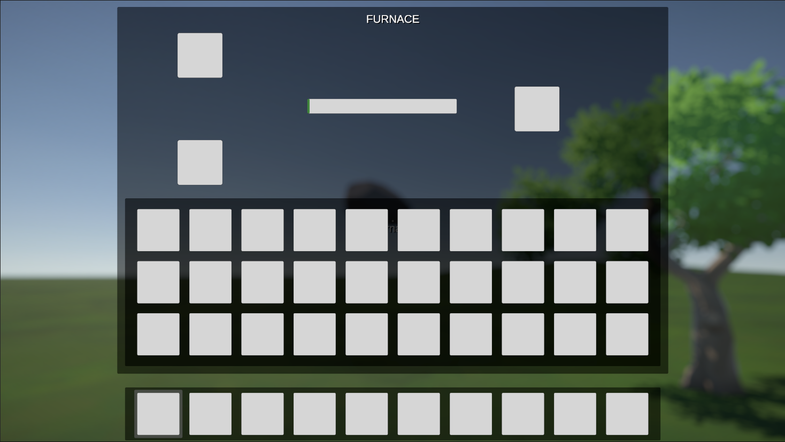
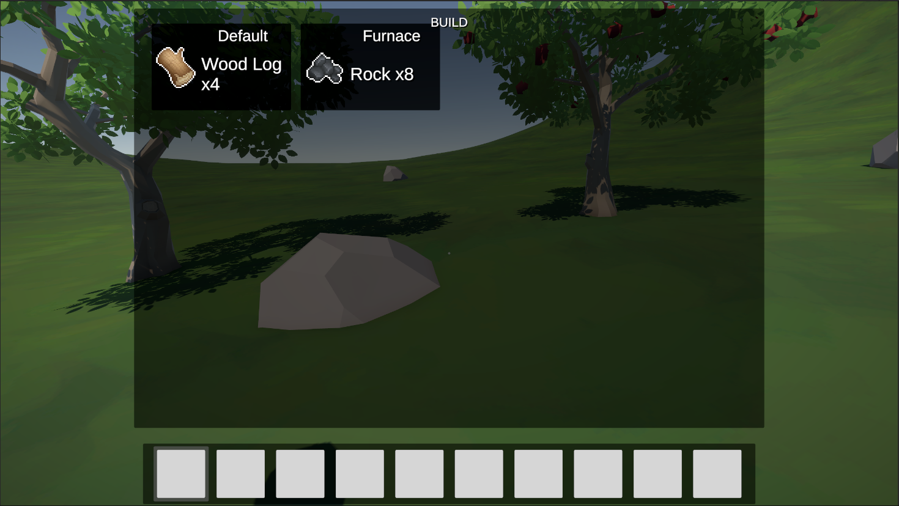
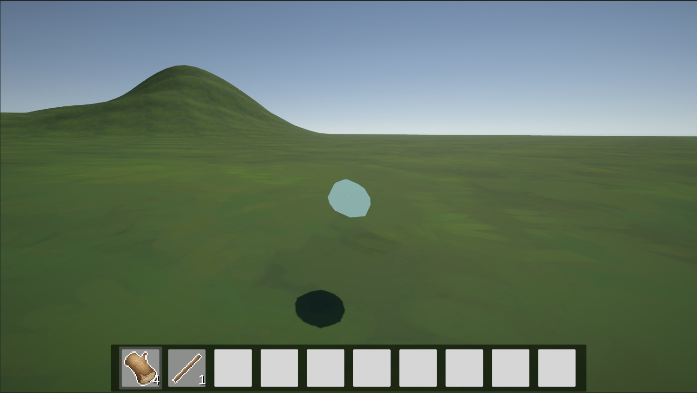
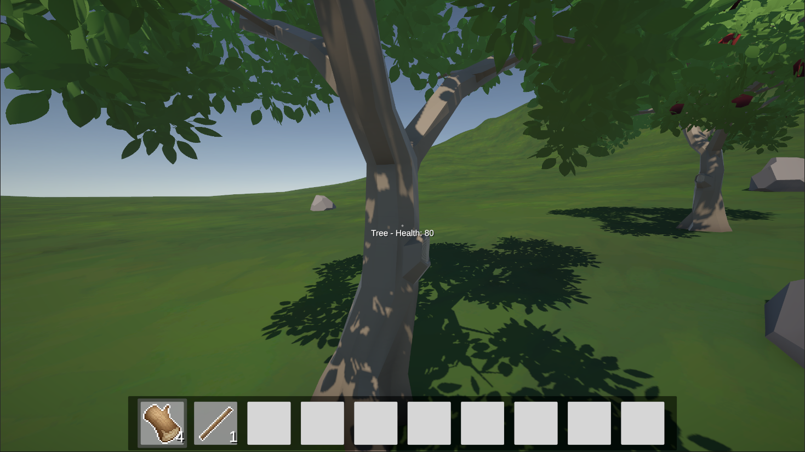

# SurvivalGame

### A 1st person survival game that takes inspiration from games like The Forest and Rust. The game is being developed in Unity.

## Features

- **Crafting System**: The player can gather resources from the environment and craft items like weapons and tools.
- **Building System**: The player can build structures and items like furnaces.

## Controls

- **Movement**: WASD
- **Punch**: Left Mouse Button
- **Jump**: Space
- **Run**: Shift
- **Interact**: E
- **Inventory**: Tab
- **Crafting**: Insides inventory
- **Building**: Q

## Planned Features

- **More structures to build**
- **More items to craft**
- **Entities** (animals, enemies, etc.)
- **Day/Night cycle**

## Screenshots

